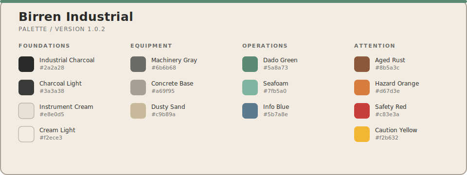

# Birren Industrial

Birren Industrial is a shared palette for Ghostty, VS Code, and Vim/Neovim. It is inspired by Faber Birren's
industrial color theory: cool colors support normal operation, warm colors call attention to exceptional states,
and neutral colors provide structure.

`default.nix` is the source of truth for palette values. It renders the application-specific `.in` templates into
native theme files, so palette changes should be made in Nix rather than duplicated in individual themes.

## Palette



The palette preview is rendered from the same Nix-managed colors as the application themes.

Regenerate or validate the committed README asset from this directory:

```console
make preview-update
make preview-check
```

## Applications

- `ghostty/`: terminal foreground, background, cursor, selection, and ANSI palette.
- `vscode/`: dark and light color themes packaged as a local VS Code extension.
- `vim/`: Vim/Neovim color scheme.

## Versioning

`version` in `default.nix` is the shared theme release version. Bump its patch component whenever palette values or
rendered theme behavior changes; documentation and packaging-only changes do not require a bump.

The version is emitted into each rendered target:

- Ghostty: `rg '^# Birren Industrial version:' ~/.config/ghostty/themes/birren-industrial-light`
- Vim/Neovim: `:echo g:birren_industrial_version`
- VS Code: the installed extension's manifest version

Nix store paths continue to track every source change independently of this human-readable release version.

## VS Code Mapping

### Dark Mode

Cool colors for normal operations:

- Industrial Seafoam: strings, headings, success, and primary UI.
- Dado Green: string escapes and active selections.
- Info Blue: comments, types, and supplementary information.

Warm colors for alerts and attention:

- Safety Red: errors, numbers, and constants.
- Hazard Orange: keywords, tags, and modifications.
- Caution Yellow: functions and find matches.
- Aged Rust: attributes and special elements.

Neutral colors for structure:

- Industrial Charcoal: background.
- Charcoal Light: secondary backgrounds.
- Instrument Cream: primary text.
- Machinery Gray: borders and inactive elements.
- Concrete Base: operators, punctuation, and muted text.

### Light Mode

Cool colors for normal operations:

- Dado Green: strings, headings, success, and primary UI.
- Industrial Seafoam: string escapes and bright accents.
- Info Blue: types, links, and informational content.

Warm colors for alerts and attention:

- Safety Red: errors, numbers, and constants.
- Aged Rust: keywords and tags.
- Hazard Orange: functions and warnings.
- Caution Yellow: find matches and conflicts.

Neutral colors for structure:

- Instrument Cream: background.
- Cream Dark: secondary backgrounds.
- Industrial Charcoal: primary text.
- Machinery Gray: comments and operators.
- Concrete Base: borders and muted elements.

### Functional Coding

- Warm colors are reserved for errors, warnings, and important syntax.
- Cool colors dominate everyday code reading.
- The contrast follows control-room design, where warm colors indicate attention.
- Light mode uses deeper greens and more muted warm tones for readability.
